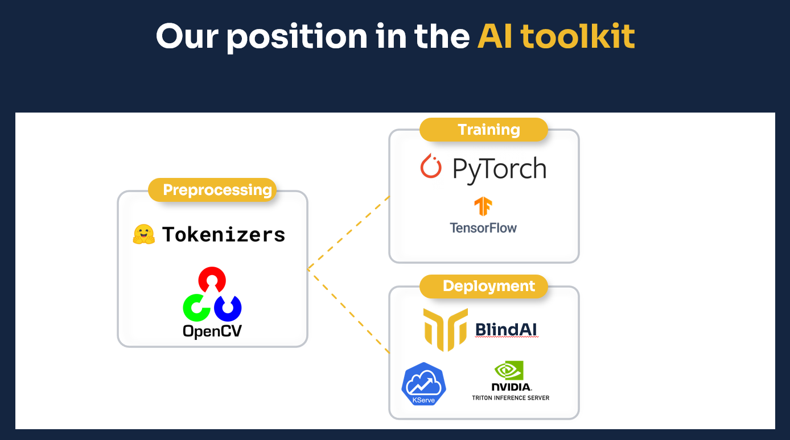
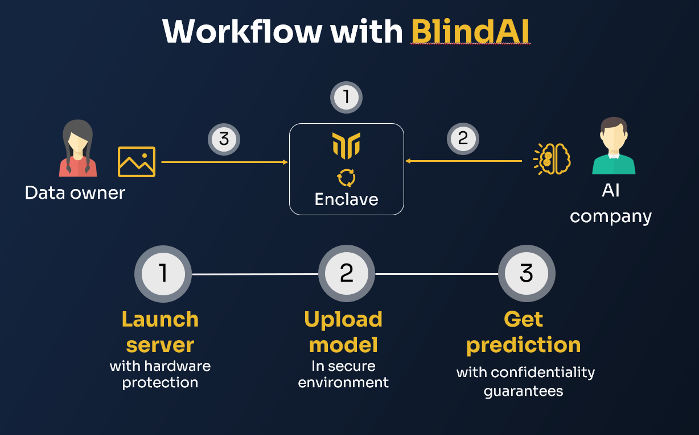

  

<h1 align="center">Mithril Security – BlindAI</h1>

<h4 align="center">
  <a href="https://www.mithrilsecurity.io">Website</a> |
  <a href="https://blindai.mithrilsecurity.io/">Documentation</a> |
  <a href="https://blog.mithrilsecurity.io/">Blog</a> |
  <a href="https://hub.docker.com/u/mithrilsecuritysas">Docker Hub</a> |
  <a href="https://www.linkedin.com/company/mithril-security-company">LinkedIn</a> | 
  <a href="https://www.twitter.com/mithrilsecurity">Twitter</a> | 
  <a href="https://discord.gg/TxEHagpWd4">Discord</a>
</h4>

<h3 align="center">Fast, accessible and privacy friendly AI deployment 🚀🔒</h3>

BlindAI is a confidential AI inference server. Like regular AI inference solutions, BlindAI helps AI engineers serve models for end-users to benefit from their predictions, but with an added privacy layer. Data sent by users to the AI model is kept confidential at all times, from the transfer to the analysis. This way, users can benefit from AI models without ever having to expose their data in clear to anyone: neither the AI service provider, nor the Cloud provider (if any), can see the data.

Confidentiality is assured by using special hardware-enforced Trusted Execution Environments. To read more about those, read our blog series [here](https://blog.mithrilsecurity.io/confidential-computing-explained-part-1-introduction/)

Our solution comes in two parts:

- A secure inference server to serve AI models with privacy guarantees, developed using [**the Rust Programming Language**](https://www.rust-lang.org/). 🦀🦀
- A Python client SDK to securely consume the remote AI models.

## :round_pushpin: Table of content

- [:lock: Motivation](#lock-motivation)
- [:rocket: Getting started](#rocket-getting-started)
- [:book: Which part of the AI workflow do we cover?](#book-which-part-of-the-ai-workflow-do-we-cover)
- [:wrench: How do I use it?](#wrench-how-do-i-use-it)
  * [A - Export the AI workflow](#a---export-the-ai-workflow)
  * [B - Deploy it on BlindAI](#b---deploy-it-on-blindai)
- [:sunny: Models covered by BlindAI](#sunny-models-covered-by-blindai)
- [:page_facing_up: Documentation](#page_facing_up-documentation)
- [:white_check_mark: What you can do with BlindAI](#white_check_mark-what-you-can-do-with-blindai)
- [:negative_squared_cross_mark: What you cannot do with BlindAI](#negative_squared_cross_mark-what-you-cannot-do-with-blindai)
- [:computer: Current hardware support](#computer-current-hardware-support)
- [:satellite: What next](#satellite-what-next)
- [:question:FAQ](#questionfaq)
- [Telemetry](#telemetry)
- [Disclaimer](#disclaimer)

## :lock: Motivation

Today, most AI tools offer no privacy by design mechanisms, so when data is sent to be analysed by third parties, the data is exposed to malicious usage or potential leakage. 

We illustrate it below with the use of AI for voice assistants. Audio recordings are often sent to the Cloud to be analysed, leaving conversations exposed to leaks and uncontrolled usage without users’ knowledge or consent.

Currently, even though data can be sent securely with TLS, some stakeholders in the loop can see and expose data : the AI company renting the machine, the Cloud provider or a malicious insider. 

By using BlindAI, data remains always protected as it is only decrypted inside a Trusted Execution Environment, called an enclave, whose contents are protected by hardware. While data is in clear inside the enclave, it is inaccessible to the outside thanks to isolation and memory encryption. This way, data can be processed, enriched, and analysed by AI, without exposing it to external parties.

## :rocket: Getting started

We provide a [Getting started](https://blindai.mithrilsecurity.io/en/latest/getting-started/quick-start/) example on our docs, with the deployment of DistilBERT with BlindAI, to make it possible to analyze confidential text with privacy guarantees.

We have also articles and corresponding notebooks to deploy COVID-Net and Wav2vec2 with BlindAI, to enable respectively analysis of Chest X-Rays and speech with end-to-end protection. You can find them just [below](#sunny-models-covered-by-blindai) in our full table of use cases and models covered.

## :book: Which part of the AI workflow do we cover?

BlindAI is currently a solution for AI model deployment. We suppose the model has already been trained and wants to be deployed but requires privacy guarantees for the data owners sending data to the model. We focus mostly on deep learning models, though inference of random forests can be covered by BlindAI.

This scenario often comes up once you have been able to train a model on a specific dataset, most likely on premise, like on biometric, medical or financial data, and now want to deploy it at scale as a Service to your users.

BlindAI can be seen as a variant of current serving solutions, like Nvidia Triton, Torchserve, TFserve, Kserve and so on. We provide the networking layer and the client SDK to consume the service remotely and securely, thanks to our secure AI backend.

## :wrench: How do I use it?

### A - Export the AI workflow

For data scientists to deploy their workloads they must first export their AI models, and possibly their pre/post processing in ONNX format. Pytorch or Tensorflow models can easily be exported into an ONNX file. Exporting a neural network in ONNX format facilitates its deployment, as it will be optimised for inference.

Because we leverage the Tract project behind the scenes, the following operators are currently supported: https://github.com/sonos/tract#onnx 

### B - Deploy it on BlindAI

Once the model is exported and ready to be served, the workflow is always the same:

- Run our inference server, for instance using Docker. 
- Upload the ONNX model inside the inference server using our SDK. By leveraging our SDK, we make sure the IP of the model is protected as well.
- Send data securely to be analysed by the AI model with the client SDK.

## :sunny: Models covered by BlindAI

Here is a list of models BlindAI supports, the use cases it unlocks and articles to provide more context on each case. The articles are in preparation and we welcome all contributions to show how BlindAI can be used to deploy AI models with confidentiality!

| Model name           | Model family  | Link to model                                                 | Example use case                        | Article                                                                                                                               | Link to the notebook                                                                                 | Inference time (ms) | Hardware                        |
|----------------------|---------------|---------------------------------------------------------------|-----------------------------------------|---------------------------------------------------------------------------------------------------------------------------------------|------------------------------------------------------------------------------------------------------|---------------------|---------------------------------|
| DistilBERT           | BERT          | https://huggingface.co/docs/transformers/model_doc/distilbert | Sentiment analysis                      | [Deploy Transformers models with confidentiality](https://blog.mithrilsecurity.io/transformers-with-confidentiality/)                 | https://github.com/mithril-security/blindai/blob/master/examples/distilbert/BlindAI-DistilBERT.ipynb | 28.435              | Intel(R) Xeon(R) Platinum 8370C |
| COVID-Net-CXR-2      | 2D CNN        | https://github.com/lindawangg/COVID-Net                       | Chest XRAY analysis for COVID detection | [Confidential medical image analysis with COVID-Net and BlindAI](https://blog.mithrilsecurity.io/confidential-covidnet-with-blindai/) | https://github.com/mithril-security/blindai/blob/master/examples/covidnet/BlindAI-COVID-Net.ipynb    | To be announced     | To be announced                 |
| Wav2vec2             | Wav2vec       | https://huggingface.co/docs/transformers/model_doc/wav2vec2   | Speech to text                          | [Build a privacy-by-design voice assistant with BlindAI](https://blog.mithrilsecurity.io/privacy-voice-ai-with-blindai/)                                                                                                                       | https://github.com/mithril-security/blindai/blob/master/examples/wav2vec2/BlindAI-Wav2vec2.ipynb     | 617.04              | Intel(R) Xeon(R) Platinum 8370C |
| Facenet              | Resnet        | https://github.com/timesler/facenet-pytorch                   | Facial recognition                      | To be announced                                                                                                                       | https://github.com/mithril-security/blindai/blob/master/examples/facenet/BlindAI-Facenet.ipynb                                                                                      | 47.135              | Intel(R) Xeon(R) Platinum 8370C |
| YoloV5               | Yolo          | https://github.com/ultralytics/yolov5                         | Object detection                        | To be announced                                                                                                                       | To be announced                                                                                      | To be announced     | To be announced                 |
| Word2Vec             | Word2Vec      | https://spacy.io/usage/embeddings-transformers                | Document search                         | To be announced                                                                                                                       | To be announced                                                                                      | To be announced     | To be announced                 |
| Neural Random Forest | Random Forest | https://arxiv.org/abs/1604.07143                              | Credit scoring                          | To be announced                                                                                                                       | To be announced                                                                                      | To be announced     | To be announced                 |
| M5 network           | 1D CNN        | https://arxiv.org/pdf/1610.00087.pdf                          | Speaker recognition                     | To be announced                                                                                                                       | To be announced                                                                                      | To be announced     | To be announced                 |                                                                                  |

We will publish soon the scripts to run the benchmarks. 

## :page_facing_up: Documentation

To learn more about our project, do not hesitate to read our [documentation](https://blindai.mithrilsecurity.io/).

## :white_check_mark: What you can do with BlindAI

- Easily deploy state-of-the-art models with confidentiality. Run any [ONNX model](https://onnx.ai/), from **BERT** for text to **ResNets** for **images**, and much more.
- Provide guarantees to third parties, for instance clients or regulators, that you are indeed providing **data protection**, through **code attestation**.
- Explore different scenarios from confidential **Sentiment analysis**, to **medical imaging** with our pool of examples.

## :negative_squared_cross_mark: What you cannot do with BlindAI

- Our solution aims to be modular but we have yet to incorporate tools for generic pre/post processing. Specific pipelines can be covered but will require additional handwork for now.
- We do not cover training and federated learning yet, but if this feature interests you do not hesitate to show your interest through the [roadmap](https://blog.mithrilsecurity.io/our-roadmap-at-mithril-security/) or [Discord](https://discord.gg/TxEHagpWd4) channel.
- The examples we provide are simple, and do not take into account complex mechanisms such as secure storage of confidential data with sealing keys, advanced scheduler for inference requests, or complex key management scenarios. If your use case involves more than what we show, do not hesitate to **contact us** for more information.

## :computer: Current hardware support 

Our solution currently leverages Intel SGX enclaves to protect data.

If you want to deploy our solution with real hardware protection and not only simulation, you can either deploy it on premise with the right hardware specs, or rent a machine adapted for Confidential Computing in the Cloud.

You can go to [Azure Confidential Computing VMs to try](https://docs.microsoft.com/en-us/azure/confidential-computing/confidential-computing-enclaves), with our [guides available here](https://blindai.mithrilsecurity.io/en/latest/getting-started/cloud-deployment/) for deployment on DCsv2 and DCsv3.

## :satellite: What next

We intend to cover AMD SEV and Nitro Enclave in the future, which would make our solution available on GCP and AWS. 

While we only cover deployment for now, we will start working on covering more complex pre/post processing pipelines inside enclaves, and training with Nvidia secure GPUs. More information about our roadmap can be found [here](https://blog.mithrilsecurity.io/our-roadmap-at-mithril-security/).

## :question:FAQ

**Q: How do I make sure data that I send is protected**

**A:** We leverage secure enclaves to provide end-to-end protection. This means that even while your data is sent to someone else for them to apply an AI on it, your data remains protected thanks to hardware memory isolation and encryption.

We provide some information in our workshop [Reconcile AI and privacy with Confidential Computing](https://www.youtube.com/watch?v=tAT23GKMi_0).

You can also have a look on our series [Confidential Computing explained](https://blog.mithrilsecurity.io/confidential-computing-explained-part-1-introduction/).

**Q: How much slowdown should we expect when using BlindAI?**

**A:** We will provide a detailled benchmark soon. Usually you should see a negligeable slowdown with some simple models, and we have observed up to 30-40% slowdown for complex models.

**Q: What is the maximal data/model size with BlindAI?**

**A:** With the latest Intel Xeon Icelake 3rd Gen, the enclaves can now protect up to 1TB of code and data. This means that most models, even the biggest ones, can be made confidential with our solution. 

**Q: What do I need to do to use BlindAI?**

**A:** The general workflow of BlindAI is described [here](#wrench-how-do-i-use-it). Basically you need to export your model in ONNX, upload it to the server and then you can send data to be analyzed securely.

**Q: Can I use Python script with BlindAI?**

**A:** We only support ONNX models for now, but most of the time preprocessing or postprocessing workflows can be expressed using ONNX operators. In that case you just have to include it in your model before exporting it to ONNX. You can see example for instance in the [Wav2vec2 example](https://github.com/mithril-security/blindai/blob/master/examples/wav2vec2/BlindAI-Wav2vec2.ipynb).

**Q: Do you do training or federated learning?**

**A:** We do not cover training or federated learning yet. However this is definitively on our roadmap, and you should expect news from us soon. For more information, please reach out to us at contact [at] mithrilsecurity dot io.

## Telemetry

BlindAI collects anonymous data regarding general usage, this allows us to understand how you are using the project. We only collect data regarding the execution mode (Hardware/Software) and the usage metrics.

This feature can be easily disabled, by settin up the environment variable `BLINDAI_DISABLE_TELEMETRY` to 1.

You can find more information about the telemetry in our [**documentation**](https://blindai.mithrilsecurity.io/en/latest/getting-started/telemetry/).

## Disclaimer

BlindAI is still in alpha and is being actively developed. It is provided as is, use it at your own risk.
