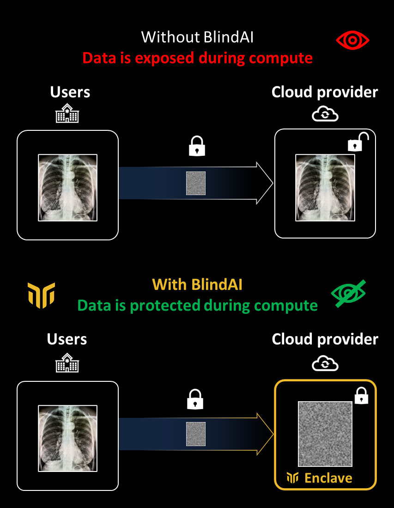

<p align="center">
  
</p>

<h1 align="center">Mithril Security – BlindAI</h1>

<h4 align="center">
  <a href="https://www.mithrilsecurity.io">Website</a> |
  <a href="https://www.linkedin.com/company/mithril-security-company">LinkedIn</a> | 
  <a href="https://blog.mithrilsecurity.io/">Blog</a> |
  <a href="https://www.twitter.com/mithrilsecurity">Twitter</a> | 
  <a href="https://docs.mithrilsecurity.io/">Documentation</a> |
  <a href="https://discord.gg/TxEHagpWd4">Discord</a>
</h4>

<h3 align="center">Fast, accessible and privacy friendly AI deployment 🚀🔒</h3>

**BlindAI** is a **fast, easy to use and confidential inference server**, allowing you to deploy your
model on sensitive data. Thanks to the **end-to-end protection guarantees**, data owners can send private data to be analyzed by AI models, **without fearing exposing their data to anyone else**.



While most current solutions force users to trust the server where their data is sent, BlindAI leverages Confidential Computing to make sure that even when you send data to a third-party to have it analyzed by an AI, it remains always protected and inaccessible.

Confidential Computing uses special hardware to ensure the privacy of a computation. You can learn more about this technology in our blog series [here](https://blog.mithrilsecurity.io/confidential-computing-explained-part-1-introduction/).

We currently only support Intel SGX, but we plan to cover AMD SEV and Nitro Enclave in the future. More information about our roadmap can be found [here](https://blog.mithrilsecurity.io/our-roadmap-at-mithril-security/).

Our solution comes in two parts:

- A secure inference server to serve AI models with privacy guarantees, developed using [**the Rust Programming Language**](https://www.rust-lang.org/). 🦀🦀
- A Python client SDK to securely consume the remote AI models.

## Models covered by BlindAI

Here is a list of models BlindAI supports, the use cases it unlocks and articles to provide more context on each case. The articles are in preparation and we welcome all contributions to show how BlindAI can be used to deploy AI models with confidentiality!

| Model name           | Model family  | Link to model                                                 | Example use case                        | Article                                                                                                                               |
|----------------------|---------------|---------------------------------------------------------------|-----------------------------------------|---------------------------------------------------------------------------------------------------------------------------------------|
| DistilBERT           | BERT          | https://huggingface.co/docs/transformers/model_doc/distilbert | Sentiment analysis                      | [Deploy Transformers models with confidentiality](https://blog.mithrilsecurity.io/transformers-with-confidentiality/)                 |
| COVID-Net-CXR-2      | 2D CNN        | https://github.com/lindawangg/COVID-Net                       | Chest XRAY analysis for COVID detection | [Confidential medical image analysis with COVID-Net and BlindAI](https://blog.mithrilsecurity.io/confidential-covidnet-with-blindai/) |
| GPT2                 | GPT           | https://huggingface.co/gpt2                                   | Document analysis                       | To be announced                                                                                                                       |
| Wav2vec2             | Wav2vec       | https://huggingface.co/docs/transformers/model_doc/wav2vec2   | Speech to text                          | To be announced                                                                                                                       |
| Facenet              | Resnet        | https://github.com/timesler/facenet-pytorch                   | Facial recognition                      | To be announced                                                                                                                       |
| YoloV5               | Yolo          | https://github.com/ultralytics/yolov5                         | Object detection                        | To be announced                                                                                                                       |
| Word2Vec             | Word2Vec      | https://spacy.io/usage/embeddings-transformers                | Document search                         | To be announced                                                                                                                       |
| Neural Random Forest | Random Forest | https://arxiv.org/abs/1604.07143                              | Credit scoring                          | To be announced                                                                                                                       |
| M5 network           | 1D CNN        | https://arxiv.org/pdf/1610.00087.pdf                          | Speaker recognition                     | To be announced                                                                                                                       |

## Getting started

### Step 1 - Deploying the server

Since the BlindAI server relies on specific hardware (Intel SGX) for security, this Getting Started guide will focus on running the Simulation mode, which can run on any machine. Note that the Simulation mode is not secure.

To learn about deploying BlindAI on real hardware, see the [Deploy on Hardware](https://docs.mithrilsecurity.io/getting-started/deploy-on-hardware) documentation page and skip the next step. Here is also a [step-by-step guide to create an SGX-enabled Azure VM and deploy BlindAI in 5 minutes](https://docs.mithrilsecurity.io/getting-started/cloud-deployment).

Run the Simulation docker image.

```bash
docker run -it -p 50051:50051 -p 50052:50052 mithrilsecuritysas/blindai-server-sim
```

### Step 2 - Uploading the model to the server

The Python client SDK has a very simple API, but it deals with most of the complexity of working with Confidential Computing. When connecting to the BlindAI server, the client will ask for a _quote_. This cryptographic _quote_ enables the client to know whether it is really talking with an Intel SGX enclave and that the loaded binary is indeed a known one. The hardware then guarantees privacy by completely isolating the server code and memory from the rest of the system.

You can learn more about the attestation mechanism for code integrity [here](https://sgx101.gitbook.io/sgx101/sgx-bootstrap/attestation).

#### Install the python library

If you feel extra-lazy, we also have a Jupyter notebook environment you can just pull and use, just run
```bash
docker run --network host mithrilsecuritysas/blindai-client-demo
```
It also contains the other examples 😉

If you don't, install the BlindAI python client using pip:

```bash
pip install blindai
```

Make sure you also have the following dependencies for this example:

```bash
pip install transformers torch
```

#### Upload the model

We will use the DistilBert model in this example.

The inference server can load any [ONNX model](https://onnx.ai/). We will export our DistilBert model from Pytorch to ONNX.

```python
from transformers import DistilBertTokenizer, DistilBertForSequenceClassification
import torch
from blindai.client import BlindAiClient, ModelDatumType

# Get pretrained model
model = DistilBertForSequenceClassification.from_pretrained("distilbert-base-uncased")

# Create dummy input for export
tokenizer = DistilBertTokenizer.from_pretrained("distilbert-base-uncased")
sentence = "I love AI and privacy!"
inputs = tokenizer(sentence, padding = "max_length", max_length = 8, return_tensors="pt")["input_ids"]

# Export the model
torch.onnx.export(
	model, inputs, "./distilbert-base-uncased.onnx",
	export_params=True, opset_version=11,
	input_names = ['input'], output_names = ['output'],
	dynamic_axes={'input' : {0 : 'batch_size'},
	'output' : {0 : 'batch_size'}})

# Launch client
client = BlindAiClient()
client.connect_server(addr="localhost", simulation=True)
client.upload_model(model="./distilbert-base-uncased.onnx", shape=inputs.shape, dtype=ModelDatumType.I64)
```

### Step 3 - Run an the model

Run the model on the inference server and get the result 🥳

```python
from transformers import DistilBertTokenizer
from blindai.client import BlindAiClient

tokenizer = DistilBertTokenizer.from_pretrained("distilbert-base-uncased")

sentence = "I love AI and privacy!"
inputs = tokenizer(sentence, padding = "max_length", max_length = 8)["input_ids"]

# Load the client
client = BlindAiClient()
client.connect_server("localhost", simulation=True)

# Get prediction
response = client.run_model(inputs)
```

### What you can do with BlindAI

- Easily deploy state-of-the-art models with confidentiality. Run any [ONNX model](https://onnx.ai/), from **BERT** for text to **ResNets** for **images**, and much more.
- Provide guarantees to third parties, for instance clients or regulators, that you are indeed providing **data protection**, through **code attestation**.
- Explore different scenarios from confidential **Sentiment analysis**, to **medical imaging** with our pool of examples.

### What you cannot do with BlindAI

- Our solution aims to be modular but we have yet to incorporate tools for generic pre/post processing. Specific pipelines can be covered but will require additional handwork for now.
- We do not cover training and federated learning yet, but if this feature interests you do not hesitate to show your interest through the [roadmap](https://blog.mithrilsecurity.io/our-roadmap-at-mithril-security/) or [Discord](https://discord.gg/TxEHagpWd4) channel.
- The examples we provide are simple, and do not take into account complex mechanisms such as secure storage of confidential data with sealing keys, advanced scheduler for inference requests, or complex key management scenarios. If your use case involves more than what we show, do not hesitate to **contact us** for more information.

## Telemetry

BlindAI collects anonymous data regarding general usage, this allows us to understand how you are using the project. We only collect data regarding the execution mode (Hardware/Software) and the usage metrics.

This feature can be easily disabled, by settin up the environment variable `BLINDAI_DISABLE_TELEMETRY` to 1.

You can find more information about the telemetry in our [**documentation**](https://docs.mithrilsecurity.io/telemetry/).

## Disclaimer

BlindAI is still in alpha and is being actively developed. It is provided as is, use it at your own risk.
