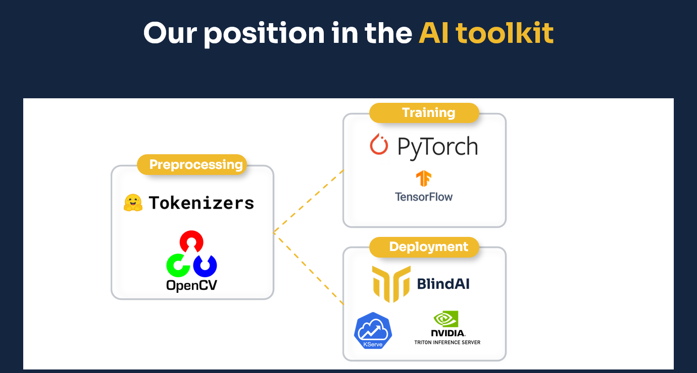

<p align="center">
  
</p>

<h1 align="center">Mithril Security – BlindAI</h1>

<h4 align="center">
  <a href="https://www.mithrilsecurity.io">Website</a> |
  <a href="https://www.linkedin.com/company/mithril-security-company">LinkedIn</a> | 
  <a href="https://blog.mithrilsecurity.io/">Blog</a> |
  <a href="https://www.twitter.com/mithrilsecurity">Twitter</a> | 
  <a href="https://docs.mithrilsecurity.io/">Documentation</a> |
  <a href="https://hub.docker.com/u/mithrilsecuritysas*">DockerHub</a> |
  <a href="https://discord.gg/TxEHagpWd4">Discord</a>
</h4>

<h3 align="center">Fast, accessible and privacy friendly AI deployment 🚀🔒</h3>

BlindAI is a confidential AI inference server. Like regular AI inference solutions, BlindAI helps AI engineers serve models for end-users to benefit from their predictions, but with an added privacy layer. Data sent by users to the AI model is kept confidential at all times, from the transfer to the analysis. This way, users can benefit from AI models without ever having to expose their data in clear to anyone: neither the AI service provider, nor the Cloud provider (if any), can see the data.

Confidentiality is assured by using special hardware-enforced Trusted Execution Environments. To read more about those, read our blog series [here](https://blog.mithrilsecurity.io/confidential-computing-explained-part-1-introduction/)

Our solution comes in two parts:

- A secure inference server to serve AI models with privacy guarantees, developed using [**the Rust Programming Language**](https://www.rust-lang.org/). 🦀🦀
- A Python client SDK to securely consume the remote AI models.

## Motivation

Today, most AI tools offer no privacy by design mechanisms, so when data is sent to be analysed by third parties, the data is exposed to malicious usage or potential leakage. 

We illustrate it below with the use of AI for voice assistants. Audio recordings are often sent to the Cloud to be analysed, leaving conversations exposed to leaks and uncontrolled usage without users’ knowledge or consent.


Currently, even though data can be sent securely with TLS, some stakeholders in the loop can see and expose data : the AI company renting the machine, the Cloud provider or a malicious insider. 


By using BlindAI, data remains always protected as it is only decrypted inside a Trusted Execution Environment, called an enclave, whose contents are protected by hardware. While data is in clear inside the enclave, it is inaccessible to the outside thanks to isolation and memory encryption. This way, data can be processed, enriched, and analysed by AI, without exposing it to external parties.

## Which part of the AI workflow do we cover?



BlindAI is currently a solution for AI model deployment. We suppose the model has already been trained and wants to be deployed but requires privacy guarantees for the data owners sending data to the model. We focus mostly on deep learning models, though inference of random forests can be covered by BlindAI.

This scenario often comes up once you have been able to train a model on a specific dataset, most likely on premise, like on biometric, medical or financial data, and now want to deploy it at scale as a Service to your users.

BlindAI can be seen as a variant of current serving solutions, like Nvidia Triton, Torchserve, TFserve, Kserve and so on. We provide the networking layer and the client SDK to consume the service remotely and securely, thanks to our secure AI backend.

## How do I use it?

### A - Export the AI workflow

For data scientists to deploy their workloads they must first export their AI models, and possibly their pre/post processing in ONNX format. Pytorch or Tensorflow models can easily be exported into an ONNX file. Exporting a neural network in ONNX format facilitates its deployment, as it will be optimised for inference.

Because we leverage the Tract project behind the scenes, the following operators are currently supported: https://github.com/sonos/tract#onnx 

### B - Deploy it on BlindAI


Once the model is exported and ready to be served, the workflow is always the same:

- Run our inference Docker, for instance using Docker, it simply needs to be exported in our secure AI deployment solution using our SDK. 
- Upload the ONNX model inside the inference server using our SDK. By leveraging our SDK, we make sure the IP of the model is protected as well.
- Send data securely to be analysed by the AI model using our SDK.

We describe these steps in more details in the [Getting started](#Getting-started) section and in even further details in our [docs](https://docs.mithrilsecurity.io/getting-started/quick-start).

## Current hardware support 

Our solution currently leverages Intel SGX enclaves to protect data.

If you want to deploy our solution with real hardware protection and not only simulation, you can either deploy it on premise with the right hardware specs, or rent a machine adapted for Confidential Computing in the Cloud.

You can have a look at our recommendations for Intel SGX here if you want to try with real hardware on your premises.

Or you can go to Azure Confidential Computing VMs to try, with our guides available here.

## What next

We intend to cover AMD SEV and Nitro Enclave in the future, which would make our solution available on GCP and AWS. 

While we only cover deployment for now, we will start working on covering more complex pre/post processing pipelines inside enclaves, and training with Nvidia secure GPUs. More information about our roadmap can be found [here](https://blog.mithrilsecurity.io/our-roadmap-at-mithril-security/).

## Models covered by BlindAI

Here is a list of models BlindAI supports, the use cases it unlocks and articles to provide more context on each case. The articles are in preparation and we welcome all contributions to show how BlindAI can be used to deploy AI models with confidentiality!

| Model name           | Model family  | Link to model                                                 | Example use case                        | Article                                                                                                                               | Link to the notebook                                                                                 |
|----------------------|---------------|---------------------------------------------------------------|-----------------------------------------|---------------------------------------------------------------------------------------------------------------------------------------|------------------------------------------------------------------------------------------------------|
| DistilBERT           | BERT          | https://huggingface.co/docs/transformers/model_doc/distilbert | Sentiment analysis                      | [Deploy Transformers models with confidentiality](https://blog.mithrilsecurity.io/transformers-with-confidentiality/)                 | https://github.com/mithril-security/blindai/blob/master/examples/distilbert/BlindAI-DistilBERT.ipynb |
| COVID-Net-CXR-2      | 2D CNN        | https://github.com/lindawangg/COVID-Net                       | Chest XRAY analysis for COVID detection | [Confidential medical image analysis with COVID-Net and BlindAI](https://blog.mithrilsecurity.io/confidential-covidnet-with-blindai/) | https://github.com/mithril-security/blindai/blob/master/examples/covidnet/BlindAI-COVID-Net.ipynb    |
| Wav2vec2             | Wav2vec       | https://huggingface.co/docs/transformers/model_doc/wav2vec2   | Speech to text                          | To be announced                                                                                                                       | https://github.com/mithril-security/blindai/blob/master/examples/wav2vec2/BlindAI-Wav2vec2.ipynb     |
| Facenet              | Resnet        | https://github.com/timesler/facenet-pytorch                   | Facial recognition                      | To be announced                                                                                                                       | To be announced                                                                                      |
| YoloV5               | Yolo          | https://github.com/ultralytics/yolov5                         | Object detection                        | To be announced                                                                                                                       | To be announced                                                                                      |
| Word2Vec             | Word2Vec      | https://spacy.io/usage/embeddings-transformers                | Document search                         | To be announced                                                                                                                       | To be announced                                                                                      |
| Neural Random Forest | Random Forest | https://arxiv.org/abs/1604.07143                              | Credit scoring                          | To be announced                                                                                                                       | To be announced                                                                                      |
| M5 network           | 1D CNN        | https://arxiv.org/pdf/1610.00087.pdf                          | Speaker recognition                     | To be announced                                                                                                                       | To be announced                                                                                      |

## Getting started

### Step 1 - Deploying the server

Since the BlindAI server relies on specific hardware (Intel SGX) for security, this Getting Started guide will focus on running the Simulation mode, which can run on any machine. Note that the Simulation mode is not secure.

To learn about deploying BlindAI on real hardware, see the [Deploy on Hardware](https://docs.mithrilsecurity.io/getting-started/deploy-on-hardware) documentation page and skip the next step. Here is also a [step-by-step guide to create an SGX-enabled Azure VM and deploy BlindAI in 5 minutes](https://docs.mithrilsecurity.io/getting-started/cloud-deployment).

Run the Simulation docker image.

```bash
docker run -it -p 50051:50051 -p 50052:50052 mithrilsecuritysas/blindai-server-sim
```

### Step 2 - Uploading the model to the server

The Python client SDK has a very simple API, but it deals with most of the complexity of working with Confidential Computing. When connecting to the BlindAI server, the client will ask for a _quote_. This cryptographic _quote_ enables the client to know whether it is really talking with an Intel SGX enclave and that the loaded binary is indeed a known one. The hardware then guarantees privacy by completely isolating the server code and memory from the rest of the system.

You can learn more about the attestation mechanism for code integrity [here](https://sgx101.gitbook.io/sgx101/sgx-bootstrap/attestation).

#### Install the python library

If you feel extra-lazy, we also have a Jupyter notebook environment you can just pull and use, just run
```bash
docker run --network host mithrilsecuritysas/blindai-client-demo
```
It also contains the other examples 😉

If you don't, install the BlindAI python client using pip:

```bash
pip install blindai
```

Make sure you also have the following dependencies for this example:

```bash
pip install transformers torch
```

#### Upload the model

We will use the DistilBert model in this example.

The inference server can load any [ONNX model](https://onnx.ai/). We will export our DistilBert model from Pytorch to ONNX.

```python
from transformers import DistilBertTokenizer, DistilBertForSequenceClassification
import torch
from blindai.client import BlindAiClient, ModelDatumType

# Get pretrained model
model = DistilBertForSequenceClassification.from_pretrained("distilbert-base-uncased")

# Create dummy input for export
tokenizer = DistilBertTokenizer.from_pretrained("distilbert-base-uncased")
sentence = "I love AI and privacy!"
inputs = tokenizer(sentence, padding = "max_length", max_length = 8, return_tensors="pt")["input_ids"]

# Export the model
torch.onnx.export(
	model, inputs, "./distilbert-base-uncased.onnx",
	export_params=True, opset_version=11,
	input_names = ['input'], output_names = ['output'],
	dynamic_axes={'input' : {0 : 'batch_size'},
	'output' : {0 : 'batch_size'}})

# Launch client
client = BlindAiClient()
client.connect_server(addr="localhost", simulation=True)
client.upload_model(model="./distilbert-base-uncased.onnx", shape=inputs.shape, dtype=ModelDatumType.I64)
```

### Step 3 - Run an the model

Run the model on the inference server and get the result 🥳

```python
from transformers import DistilBertTokenizer
from blindai.client import BlindAiClient

tokenizer = DistilBertTokenizer.from_pretrained("distilbert-base-uncased")

sentence = "I love AI and privacy!"
inputs = tokenizer(sentence, padding = "max_length", max_length = 8)["input_ids"]

# Load the client
client = BlindAiClient()
client.connect_server("localhost", simulation=True)

# Get prediction
response = client.run_model(inputs)
```

### What you can do with BlindAI

- Easily deploy state-of-the-art models with confidentiality. Run any [ONNX model](https://onnx.ai/), from **BERT** for text to **ResNets** for **images**, and much more.
- Provide guarantees to third parties, for instance clients or regulators, that you are indeed providing **data protection**, through **code attestation**.
- Explore different scenarios from confidential **Sentiment analysis**, to **medical imaging** with our pool of examples.

### What you cannot do with BlindAI

- Our solution aims to be modular but we have yet to incorporate tools for generic pre/post processing. Specific pipelines can be covered but will require additional handwork for now.
- We do not cover training and federated learning yet, but if this feature interests you do not hesitate to show your interest through the [roadmap](https://blog.mithrilsecurity.io/our-roadmap-at-mithril-security/) or [Discord](https://discord.gg/TxEHagpWd4) channel.
- The examples we provide are simple, and do not take into account complex mechanisms such as secure storage of confidential data with sealing keys, advanced scheduler for inference requests, or complex key management scenarios. If your use case involves more than what we show, do not hesitate to **contact us** for more information.

## Telemetry

BlindAI collects anonymous data regarding general usage, this allows us to understand how you are using the project. We only collect data regarding the execution mode (Hardware/Software) and the usage metrics.

This feature can be easily disabled, by settin up the environment variable `BLINDAI_DISABLE_TELEMETRY` to 1.

You can find more information about the telemetry in our [**documentation**](https://docs.mithrilsecurity.io/telemetry/).

## Disclaimer

BlindAI is still in alpha and is being actively developed. It is provided as is, use it at your own risk.
