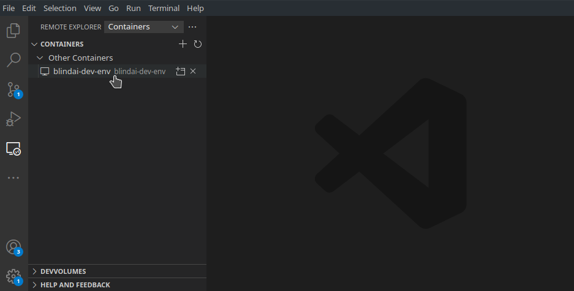
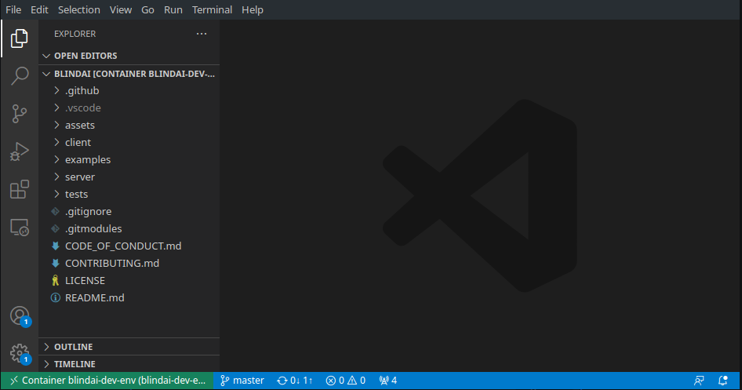
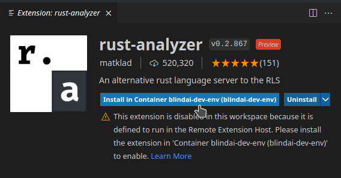

# Setting up your dev environment

## Using Docker 🐳

This is by far the **easiest** method to get started, since you don't have to deal with installing the Intel drivers. Also, the Intel SGX drivers and SGX SDK are not officially supported in some distributions. The Docker image provides a clean and easy way to have a working development environment for any OS that supports Docker.

We directly provide a docker image that has everything you need to build and work on BlindAI server. To use it, clone the repository and run:

```bash
DOCKER_BUILDKIT=1 docker build \
  -f ./server/docker/build.dockerfile \
  -t blindai-dev-env \
  --target base-build \
  ./server
```

Then, to start it:

```bash
docker create -it \
  --name blindai-dev-env \
  -p 50051:50051 \
  -p 50052:50052 \
  --volume $(pwd):/root/blindai \
  blindai-dev-env \
  /bin/bash
```

You can then use Visual Studio Code to directly work in that container using the [Remote - Containers](https://marketplace.visualstudio.com/items?itemName=ms-vscode-remote.remote-containers) extension. Once installed, you wil have acces to this Remote tab. Use it to launch vscode in the `blindai-dev-env` container you just created.



Then open the `/root/blindai` folder, and you're good to go!



You probably also want to install the Rust Analyzer extension in the docker container. To do that, use the extensions menu, find Rust Analyzer and click "Install in container".



## Without Docker

If you don't want to use docker, you will need to install the following:

* Intel SGX DCAP **1.41** Driver
* Intel SGX SDK v2.15.1
* Intel SGX PSW (version 2.15.101.1 for the PSW librairies and 1.12.101.1 for the PSW-DCAP librairies)
* Rust nightly-2021-11-01 with Xargo

You can find the [installation guides](https://download.01.org/intel-sgx/sgx-linux/2.9/docs/) for Intel SGX software on the 01.org website.


Note: if you are running on a machine without SGX support, you will need the simulation versions of the Intel PSW and SDK.

