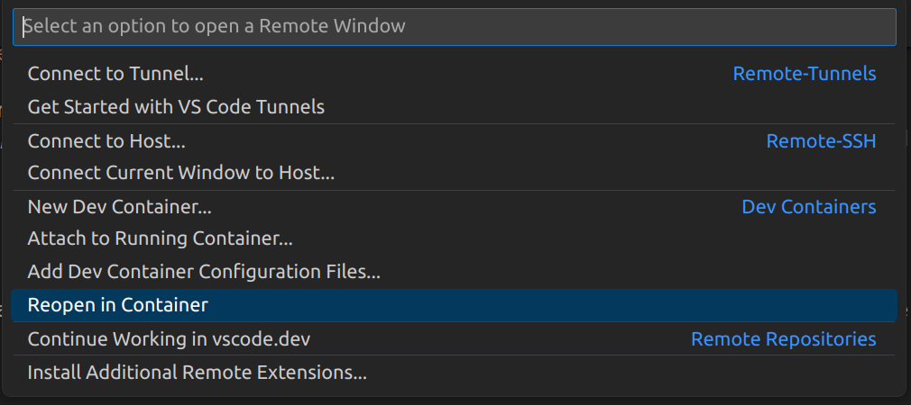
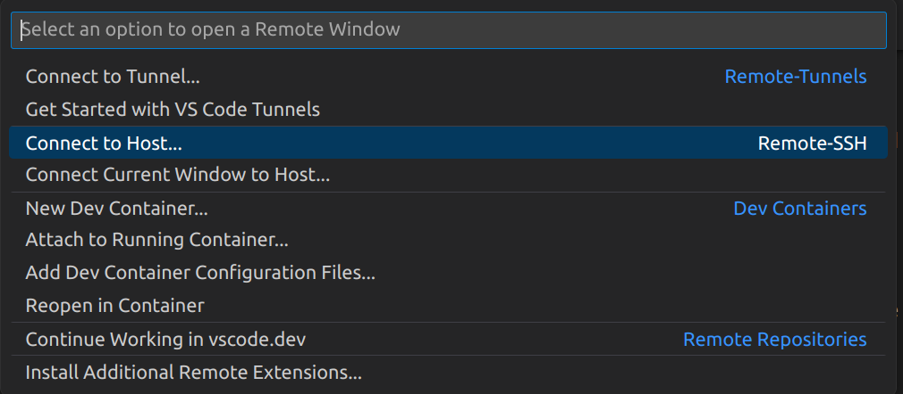

### Development environment
If you want to make changes to the code, it is recommended you use our pre-configured development container, which contains all the dependencies you need to run and use blindai.

Firstly, in order to be able to run tests with the server, you'll need to work on an SGX2-ready machine. To find out more about how to do this, check out our [installation page](../../tutorials/core/installation.md).

Now you're ready to set up your development environment!

- If you are working on the  Azure DCsv3 VM, click <a href="#Azure dev environment">here</a>**
- If you are working on your local machine, click here <a href="#Standard dev environment ">here</a>**


## Standard dev environment

To set up our pre-configured development container, you can follow these instructions:

1. Clone blindai github repo and submodules.
```bash
git clone https://github.com/mithril-security/blindai-preview --recursive
cd blindai-preview
```

2. Make sure you have docker installed on your machine. 
- If you need to install Docker, you can follow [the official Docker installation instructions](https://docs.docker.com/engine/install). 

You also need to make sure you haver the correct permissions to run docker commands without `sudo`. 
To check this, try running `docker run hello-world`. If this works, you can skip straight to the next step. If it doesn't, you need to add yourself to docker group: 
```bash
sudo usermod -aG docker $USER && newgrp docker
```
3. Open the `blindai-preview` folder in VSCode.   

4. Make sure you have the `remote container VSCode extension` installed. If you don't, install this from the VSCode extensions marketplace.

5. Open the green menu at the bottom-left of Visual Studio Code.


Choose: `Dev Containers: Reopen in Container`.


This may take some time since there are several dependencies that must be installed.

>If you have any issues with this process, make sure you have the BlindAI folder open in your VSCode window.

### Building client from source

To compile the client code locally:
```bash
cd client
poetry install
```

### Building server from source

You can build and run the server from source using the `justfile`:
```bash
just run
```

>Make sure you are in the root of the blindai-preview directory to make use of the justfile commands.

>Note that by default the port opened in 9923 is running on http only. For production, we strongly recommend setting up a ***reverse-proxy*** that will manage and encrypt the traffic from the client to the blindAI server. Many free reverse-proxy implementations exist, such as **caddy**, **Nginx** and **Apache**:

- [https://caddyserver.com/docs/quick-starts/reverse-proxy](https://caddyserver.com/docs/quick-starts/reverse-proxy)
- [Nginx reverse proxy set-up guide](https://docs.nginx.com/nginx/admin-guide/web-server/reverse-proxy/)
- [Apache reverse proxy set-up guide](https://httpd.apache.org/docs/2.4/howto/reverse_proxy.html)

If you do not set up a reverse proxy, users will need to set the `hazmat_http_on_untrusted_port` option to `True` when using blindai-preview's `connect()` function. Again, this is **not recommended** for production.

>Note that if you make any changes to the server code, a new `manifest.toml` file will be created when you build the server. In order to be able to connect with the server instance using the BlindAI Core `connect()` method, you will need to supply a path to a copy of this file in the `hazmat_manifest_path` option. The manifest.toml files are used during the verification step of the connection progress to check that the server is not running any unexpected and potentially malicious code. You can learn more about this verification process [here](../../getting-started/confidential_computing.md).

------------------------------------------------


## Azure dev environment

To set up our pre-configured development container for your Azure VM, you can follow these instructions:

1. Clone blindai github repo and submodules.
```bash
git clone https://github.com/mithril-security/blindai-preview --recursive
cd blindai-preview
```

2. Make sure you have docker installed on your machine. 
- If you need to install Docker, you can follow [the official Docker installation instructions](https://docs.docker.com/engine/install). 

You also need to make sure you haver the correct permissions to run docker commands without `sudo`. 
To check this, try running `docker run hello-world`. If this works, you can skip straight to the next step. If it doesn't, you need to add yourself to docker group: 
```bash
sudo usermod -aG docker $USER && newgrp docker
```
3. Open the `blindai-preview` folder in VSCode.

4. Make sure you have the `remote container VSCode extension` installed. If you don't, install this from the VSCode extensions marketplace.

5. Make sure you are connected to your VM as host. To do this, open the green menu at the bottom-left of Visual Studio Code.


Choose: `Connect to host` and select your host.


6. Next, open the green menu at the bottom-left of Visual Studio Code again and choose: 
`Dev Containers: Reopen in Container`.


This may take some time since there are several dependencies that must be installed.

>If you have any issues with this process, make sure you have the BlindAI folder open in your VSCode window.

### Building client from source

To compile the client code locally:
```bash
cd client
poetry install
```

### Building server from source

You can build and run the server from source using the `justfile`:
```bash
just run
```

>Make sure you are in the root of the blindai-preview directory to make use of the justfile commands.

>Note that by default the port opened in 9923 is running on http only. For production, we strongly recommend setting up a ***reverse-proxy*** that will manage and encrypt the traffic from the client to the blindAI server. Many free reverse-proxy implementations exist, such as **caddy**, **Nginx** and **Apache**:

- [https://caddyserver.com/docs/quick-starts/reverse-proxy](https://caddyserver.com/docs/quick-starts/reverse-proxy)
- [Nginx reverse proxy set-up guide](https://docs.nginx.com/nginx/admin-guide/web-server/reverse-proxy/)
- [Apache reverse proxy set-up guide](https://httpd.apache.org/docs/2.4/howto/reverse_proxy.html)

If you do not set up a reverse proxy, users will need to set the `hazmat_http_on_untrusted_port` option to `True` when using blindai-preview's `connect()` function. Again, this is **not recommended** for production.

>Note that if you make any changes to the server code, a new `manifest.toml` file will be created when you build the server. In order to be able to connect with this server instance using the BlindAI Core `connect()` method, you will need to supply a path to a copy of this file in the `hazmat_manifest_path` option. The manifest.toml files are used during the verification step of the connection progress to check that the server is not running any unexpected and potentially malicious code. You can learn more about this verification process [here](../../getting-started/confidential_computing.md).