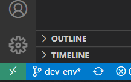

# Setting up your dev environment

## Using remote container extension on Visual Studio Code 🐳

You can directly clone the repo and open it in VS Code. Using the remote container extension, Visual Studio Code should prompt you to install it. 

Open the green menu at the bottom-left of the Visual Studio Code.
Choose: "Open folder in container".

It will build and run the image present in the [`.devcontainer` folder](https://github.com/mithril-security/blindai-preview/tree/main/.devcontainer) and it will run the dev environment directly on VSCode.

!!! Warning 
    there is a different one for Azure in the : `devcontainer-azure/` folder

You can check that everything is correctly set-up by [Running the tests](../../../index.md#testing)

## Without Docker

If you don't want to use docker, you will need to install the following:

* Intel SGX DCAP **1.41** Driver
* Intel SGX SDK v2.15.1
* Intel SGX PSW (version 2.15.101.1 for the PSW librairies and 1.12.101.1 for the PSW-DCAP librairies)
* Fortanix EDP and its dependencies

You can find the [installation guides](https://download.01.org/intel-sgx/sgx-linux/2.9/docs/) for Intel SGX software on the 01.org website.

You can find the [installation guides](https://edp.fortanix.com/docs/installation/guide/) for fortanix EDP on their official website. 

Note: if you are running on a machine without SGX support, you will need the simulation versions of the Intel PSW and SDK.