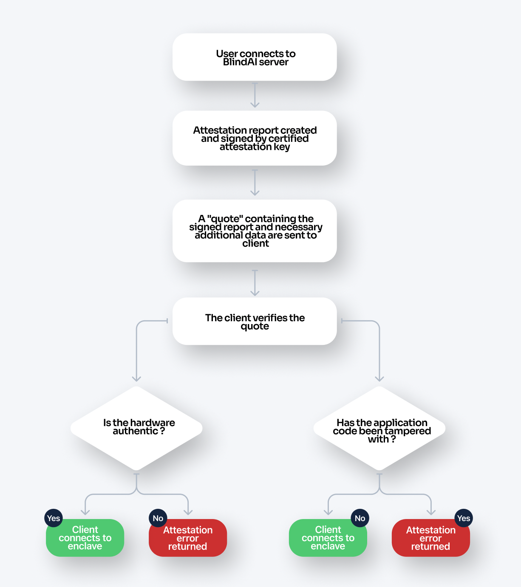

# Secure Enclaves
________________________________________

BlindAI protects user data using **Intel SGX**. In this guide, we will take a look at the technology behind SGX enclaves in more detail.

>If you want some more contextual information about TEEs, Trusted Computing Bases and attestation, check out our guide to confidential computing [here](../getting-started/confidential_computing.md).

## Intel SGX
____________________________

Intel SGX enclaves can be created at runtime on SGX-enabled systems. Applications designed for SGX enclaves split the application into two parts: an **untrusted “host”** and a **trusted “enclave”** which run inside a **TEE**. The enclave contains sensitive code and/or data. The host part contains non-sensitive code.

### Trusted Execution Environment (TEE)

Programs running in an Intel SGX enclave are **fully isolated from the rest of the system**. 

The enclave is created within a private region of memory that is isolated from other processes running, even those with higher privilege levels. **External access is always denied.**

!!! important 

	SGX enclaves can access the memory of the trusted “host” part of the application - but the opposite isn't possible!

### Trusted Computing Base (TCB)

Intel SGX has pursued a **very minimal TCB**. The TCB of our enclave application only contains the "trusted" parts of the application and a small section of the hardware, the CPU.

This means that our enclave will not be impacted by any bugs or vulnerabilities occurring in the host machine’s OS, hypervisor, firmware or hardware outside of the CPU.

### Attestation

The attestation process allows a client wishing to connect to an enclave to first **verify the identity of the enclave**, **the enclave's application code** and the **authenticity of the hardware** the enclave is running on.

Let’s walk through how this process works in BlindAI, step-by-step.

**Pre-attestation**

- On **building** the enclave, a **manifest file** is created containing: a **hash** of the enclave itself (as a proxy for the application code), its settings and configuration, authorized instructions, etc.

- On **deployment**, the host is provisioned with a **Provisioning Certification Key (PCK) certificate** from the **Intel Provisioning Service**. This is stored by the host’s **caching service** for later use. This certificate only needs to be updated if there is a change in the host’s TCB - for example, after downloading an Intel SGX update.

- The enclave also generates a public and private **TLS key pair**. The **private key** lives and dies in the enclave and **cannot be viewed or accessed by anyone at any time**.

**The attestation process:**

1. The user first contacts the application on the unattested port outside of the enclave, triggering an **attestation request**.

2. **An attestation report is created** containing information about the **enclave’s identity/ application code**.

3. An **attestation key** is signed (or certified) by the **PCK private signing key** which is derived from hardware.

4. The **attestation key** signs the **attestation report** to prove that the enclave is running with Intel SGX protections and denoting its configuration. This **signed report** is placed within a structure called a **quote**.

5. The client is sent the **quote** along with the **collateral**. This **collateral** includes data such as the **PCK certificate** (which includes the **public key** corresponding to the PCK's private signing key) and a **TLS certificate** so that the client can establish communication with the enclave if the attestation process is successful.

6. The client receives the **quote** and **collateral**: 

    a. The **PCK certificate** is used to verify the **attestation key**. This ensures that the enclave is genuine and properly configured.

    b. The **application code and enclave settings are verified**. With BlindAI Core and BlindAI, the client contains built-in copies of the manifest.toml file for the latest official version of BlindAI. These are checked against the attestation report. If the application code has been tampered with before being launched, this verification will fail and the client will not be able to connect with the enclave.

7. If the attestation process has been successful, the client can now **establish direct communication with the enclave** via **TLS**. If it is not successful, an **attestation error** will be returned.
a detailed or exhaustive explanation is outside the scope of this article. 

>Note that this is meant to serve as a quick summary of attestation and the details of the process are complex. Please see [Intel's DCAP documentation](https://download.01.org/intel-sgx/sgx-dcap/1.3/linux/docs/Intel_SGX_ECDSA_QuoteLibReference_DCAP_API.pdf) for full details.