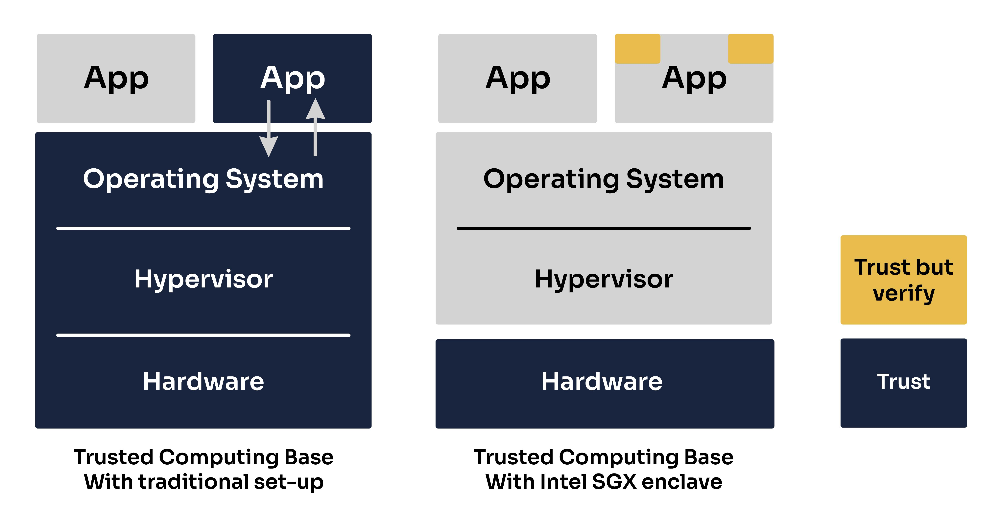
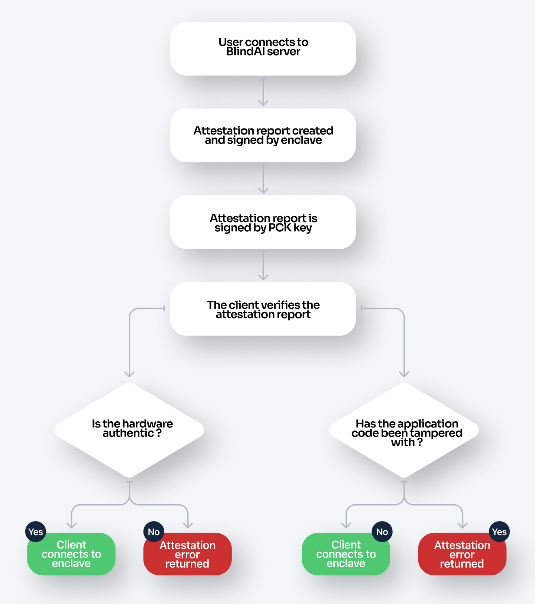

# Secure Enclaves
________________________________________

BlindAI current supports two secure enclaves, or **Trusted Execution Environments (TEEs)**: **Intel SGX** and **Nitro enclaves**. In this guide, we will take a look at how these two technologies work and what their key differences and similarities. We'll also go over where they are implemented in BlindAI.

>If you want some more contextual information about TEEs, Trusted Computing Bases and attestation, check out our guide to confidential computing [here](../getting-started/confidential_computing.md).

## Intel SGX
____________________________

Intel SGX enclaves can be created at runtime on SGX-enabled systems. Applications designed for SGX enclaves split the application into two parts: an **untrusted “host”** and a **trusted “enclave”** which run inside a **TEE**. The enclave contains sensitive code and/or data. The host part contains non-sensitive code.

### Trusted Execution Environment (TEE)

Programs running in an Intel SGX enclave are **fully isolated from the rest of the system**. 

The enclave is created within a private region of memory that is isolated from other processes running, even those with higher privilege levels. **External access is always denied.**

!!! important 

	SGX enclaves can access the memory of the trusted “host” part of the application - but the opposite isn't possible!

### Trusted Computing Base (TCB)

Intel SGX has pursued a **very minimal TCB**. The TCB of our enclave application only contains the "trusted" parts of the application and a small section of the hardware, the CPU.

This means that our enclave will not be impacted by any bugs or vulnerabilities occurring in the host machine’s OS, hypervisor, firmware or hardware outside of the CPU.

### Attestation

The attestation process allows a client wishing to connect to an enclave to first **verify the identity of the enclave**, **the enclave's application code** and the **authenticity of the hardware** the enclave is running on.

Let’s walk through how this process works in BlindAI, step-by-step.

**Pre-attestation**

- On **building** the enclave, a **manifest file** is created containing: a **hash** of the enclave itself (as a proxy for the application code), its settings and configuration, authorized instructions, etc.

- On **deployment**, the host is provisioned with a **Provisioning Certification Key (PCK) certificate** from the **Intel Provisioning Service**. This is stored by the host’s **caching service** for later use. This certificate only needs to be updated if there is a change in the host’s TCB - for example, after downloading an Intel SGX update.

- The enclave also generates a public and private **TLS key pair**. The **private key** lives and dies in the enclave and **cannot be viewed or accessed by anyone at any time**.

**The attestation process:**

1. The user first contacts the application on the unattested port outside of the enclave, triggering an **attestation request**.

2. **An attestation report or quote is created** containing information about the **enclave’s identity/ application code**. It is bound to the enclave’s **TLS certificate** so that the client can set up a communication channel if the attestation concludes successfully. It is **signed** in the enclave by an **attestation key** derived from hardware.

3. The attestation report or quote is then signed with the **PCK key** retrieved from the PCK certificate caching service.

4. The client verifies the report:

    a. The **PCK key is verified** via the host machine which enables us to check that the enclave is an authentic SGX platform and that it is up to date with all security patches.

    b. The **application code and enclave settings are verified**. With BlindAI Core and BlindAI, the client contains built-in copies of the manifest.toml file for the latest official version of BlindAI. These are checked against the attestation report. If the application code has been tampered with before being launched, this verification will fail and the client will not be able to connect with the enclave.

5. If the attestation process has been successful, the client can now **establish direct communication with the enclave** via **TLS**. If it is not successful, an **attestation error** will be returned. 

## Nitro Enclaves
________________________

Nitro Enclaves were developed by AWS to be used as secure compute environments for users on AWS EC2 VM instances.

### Trusted Execution Environment (TEE)

Unlike Intel SGX which is isolated by the CPU, the AWS TEE implementation is based on **virtualization**. Users can partition off a certain amount of the host EC2’s memory and CPU and assign that to their enclave which then runs along-side the instance. **The isolation or separation between the two environments is the same as that of two different users’ EC2 instances**. The host cannot read or access the data in the enclave and vice versa. Any communication between the host and enclave is done through a **VSOCK**.

!!! note

	One benefit of pursuing this virtualization approach compared to a memory encryption approach is that **the host instance has absolutely no visibility over the enclave’s memory whatsoever**. This memory simply doesn’t exist from the host's perspective. Therefore the host cannot try to gain any information from monitoring what memory is in use or any access patterns, etc.

Nitro enclaves are also designed to support **limited operations to reduce their attack surface**. They have **no durable storage, no network/interactive access, no metadata services, DNS, NTP**, etc… 

### Trusted Computing Base (TCB)

It is important to note that while some Confidential Computing solutions have pursued a very minimalistic TCB, this is not the case for Nitro enclaves, because it isn't the objective behind their offer. 

!!! quote "<a href="https://aws.amazon.com/fr/blogs/security/confidential-computing-an-aws-perspective/" target="__blank"> According to AWS</a>:"

	*A Nitro enclave has the same level of protection from the cloud operator as a normal Nitro-based EC2 instance, **but adds the capability for customers to divide their own systems** into components with different levels of trust.*

This is why Nitro enclaves include the same elements in their TCB as most standard applications today. They also support **cryptographic attestation**, which will verify the application code and the enclave's OS. 

While pursuing a smaller TCB can be one way to reduce the attack surface, it is important to note that isn't the only way to do so and often involves tradoffs between different measures. In this instance, our application would not be impacted by any bugs or vulnerabilities occurring in the untrusted elements (such as a bug in the AWS hypervisor), despite not reducing its TCB.

### Attestation

The **attestation process** allows users to **verify that the enclave, the code running in it and the OS of the enclave have not been tampered with**. This process is achieved through the **Nitro hypervisor**, which produces a signed attestation document for the enclave to prove its identity to the client.

The attestation certification contains the following information about the enclave.

A client wishing to connect with the enclave will verify that this information matches with the enclave application they are expecting to connect to. For example, by default, the BlindAI client expects this information to match with the latest official version of the BlindAI server application.
You can think of this as being like using a checksum to verify the authenticity of a software downloaded online.

## Comparison
______________

### Similarities

- Neither the host nor any other application running on the host can access data or tamper with computations performed in enclaves ✅ 
- Attestation verifies application code (Nitro enclaves also verify OS- this is not relevant for SGX, but SGX does verify Intel SGX hardware) ✅ 
- Both solutions provide attestation capabilities ✅ 

### Differences

### Current view of Intel SGX & Nitro Enclaves within BlindAI

| Model |  TEE options supported |
| --------------------- | ------------------------------------------ |
| Whisper on BlindAI API | `Intel SGX` (default)   `Nitro Enclave`|
| OpenChatKit on BlindAI API |      `Nitro Enclave`  |
| Custom models on BlindAI Core |     `Intel SGX`      |