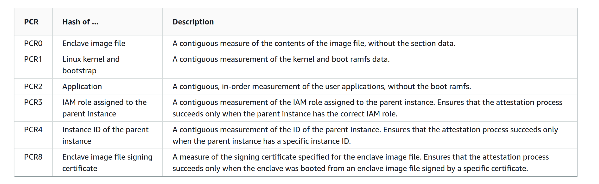
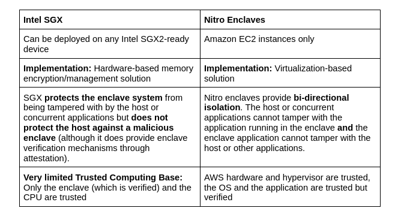

# Secure Enclaves
________________________________________

BlindBox current supports one secure enclave, or **Trusted Execution Environments (TEEs)**: **Nitro enclaves**. In this guide, we will take a look at how this technology works. We'll also go over how it is implemented in BlindBox.

>If you want some more contextual information about TEEs, Trusted Computing Bases and attestation, check out our guide to confidential computing [here](../getting-started/confidential_computing.md).

## Nitro Enclaves
________________________

Nitro Enclaves were developed by AWS to be used as secure compute environments for users on AWS EC2 VM instances.

### Trusted Execution Environment (TEE)

The AWS TEE isolation is based on **virtualization**. Users can partition off a certain amount of the host EC2’s memory and CPU and assign that to their enclave which then runs along-side the instance. **The isolation or separation between the two environments is the same as that of two different users’ EC2 instances**. The host cannot read or access the data in the enclave and vice versa. Any communication between the host and enclave is done through a **VSOCK**.

!!! note

	One benefit of pursuing this virtualization approach compared to a memory encryption approach is that **the host instance has absolutely no visibility over the enclave’s memory whatsoever**. This memory simply doesn’t exist from the host's perspective. Therefore the host cannot try to gain any information from monitoring what memory is in use or any access patterns, etc.

Nitro enclaves are also designed to support **limited operations to reduce their attack surface**. They have **no durable storage, no network/interactive access, no metadata services, DNS, NTP**, etc… 

### Trusted Computing Base (TCB)

It is important to note that while some Confidential Computing solutions have pursued a very minimalistic TCB, this is not the case for Nitro enclaves, because it isn't the objective behind their offer. 

!!! quote "<a href="https://aws.amazon.com/fr/blogs/security/confidential-computing-an-aws-perspective/" target="__blank"> According to AWS</a>:"

	*A Nitro enclave has the same level of protection from the cloud operator as a normal Nitro-based EC2 instance, **but adds the capability for customers to divide their own systems** into components with different levels of trust.*

This is why Nitro enclaves include the same elements in their TCB as most standard applications today. They also support **cryptographic attestation**, which will verify the application code and the enclave's OS. 

While pursuing a smaller TCB can be one way to reduce the attack surface (since our application would not be impacted by any bugs or vulnerabilities occurring in the untrusted elements, such as a bug in the AWS hypervisor), it is important to note that reducing your TCB size is not the only way to reduce the attack surface and often involves tradeoffs between different measures!

### Attestation

The **attestation process** allows users to **verify that the enclave, the code running in it and the OS of the enclave have not been tampered with**. This process is achieved through the **Nitro hypervisor**, which produces a signed attestation document for the enclave to prove its identity to the client.

The attestation certification contains the following information about the enclave.

A client wishing to connect with the enclave will verify that this information matches with the enclave application they are expecting to connect to. For example, by default, the BlindBox client expects this information to match with the latest official version of the BlindBox server application.
You can think of this as being like using a checksum to verify the authenticity of a software downloaded online.

## Comparison
______________

### Similarities

- Neither the host nor any other application running on the host can access data or tamper with computations performed in enclaves ✅ 
- Attestation verifies application code (Nitro enclaves also verify OS- this is not relevant for SGX, but SGX does verify Intel SGX hardware) ✅ 
- Both solutions provide attestation capabilities ✅ 

### Differences

