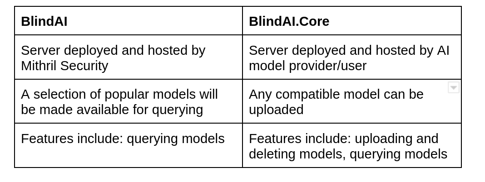

# BlindAI & BlindAI Core
________________

## What is BlindAI?

The BlindAI API is an **open-source and easy-to-use Python library**. It allows you to query popular AI models with **assurances that your private data will remain private**. 

So far, we have released **Whisper** on BlindAI, a pre-trained model for automatic speech recognition (ASR) and speech translation. More models are set to join Whisper on the platform in the future. 

>You can join our [Discord server](https://discord.com/invite/TxEHagpWd4) to keep up to date with all our new releases!

These models are uploaded to and hosted on our secure server using the underlying **BlindAI Core module**. 

## What is BlindAI Core?

BlindAI Core is the **underlying technology** behind BlindAI and is available as the **Core module within the BlindAI PyPi package**. 

BlindAI Core facilitates **privacy-friendly AI model deployment** by letting AI engineers upload and delete models to their secure BlindAI server instance. Clients can then connect to the server, upload their data and run models on it without compromising on privacy.

## BlindAI vs BlindAI Core: Key differences

Here is a summary of the **key differences** between BlindAI API and BlindAI Core:

With both **BlindAI and BlindAI Core**, data confidentiality is assured by hardware-enforced **Trusted Execution Environments**. We explain how they keep data and models safe in detail [here](https://github.com/mithril-security/blindai/blob/main/docs/docs/concepts/privacy.md).