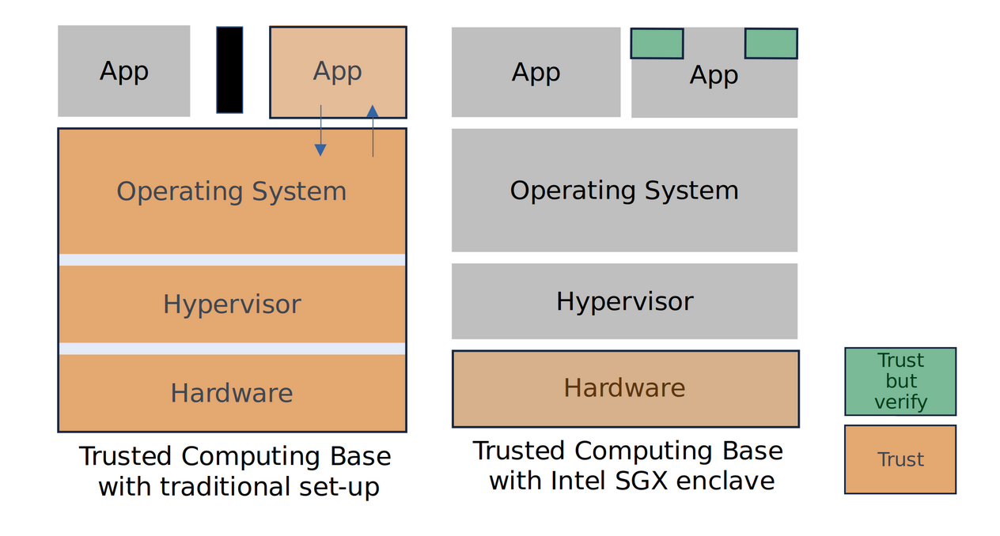
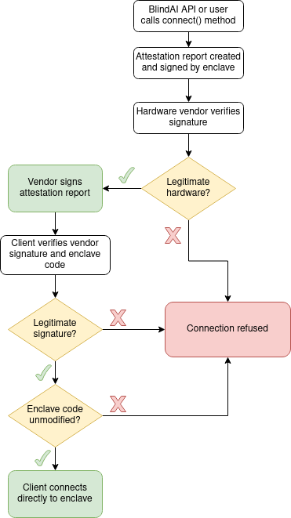

# How does BlindAI protect your data?
_________________________________

BlindAI is able to protect user data and models by leveraging the power of confidential computing, a fast-growing new technology in cybersecurity. Let’s take a look at what Confidential Computing is and how it protects your data.

The [Confidential Computing Consortium](https://confidentialcomputing.io/) (CCC) describes confidential computing as “the protection of data in use by performing computations in a hardware-based Trusted Execution Environment (TEE)”.

## What is a Trusted Execution Environment?
____________________________________

A **TEE**, otherwise known as a secure enclave, is a **highly isolated compute environment** where data and applications can reside and run. Data sent to the enclave is only decrypted inside the enclave. Even if hackers or malicious insiders gain access to the host machine an enclave is running on, they will not be able to access data inside the enclave.

TEE’s are based on the principle of **reducing the attack surface to the minimum** possible needed for the application to run. They have no shell access, no networking and no persistent storage with extremely limited outside communications.

## Trusted Computing Base
______________________________________

TEE security relies heavily on **trusting as few elements as possible**.

Normally, when you run an application on a computer, you need to trust multiple elements: the application itself, the operating system, the hypervisor and the hardware. This makes up what we call the **Trusted Computing Base** or **TCB**.

The problem is all of these elements can access the memory used by our application. An attacker could target any of these elements in order to try to steal sensitive information sent to the application.

The trusted and untrusted elements for a TEE can vary depending on the hardware manufacturer whether this is Intel with their SGX enclave, AWS with their Nitro enclave, etc. But the objective is always the same: reduce the TCB as much as possible. In the case of Intel SGX, which we use for BlindAI, we only need to trust small sections of the application we are running, which are verified during the attestation process, and the hardware of semiconductor chip manufacturers.

The attack surface is therefore drastically reduced.

## Attestation
___________________

When a user wants to establish communication with an enclave, checks will first be performed to **verify the authenticity** of these trusted elements.

In the case of Intel SGX, used by BlindAI Core, we are able to verify that this is a genuine Intel SGX enclave running on Intel SGX hardware and that the application code running in the enclave is the code we expected and has not been tampered with. 

### So how does attestation work?

- On building the enclave, **a policy file** is created containing a hash of the enclave itself, the application code inside it, its settings and configuration, authorized instructions, etc.
- The user first contacts the application on the unattested port outside of the enclave, triggering an **attestation request**.
- The enclave will **generate a public and private TLS key pair**. The private key is stored securely in the enclave and cannot be viewed or accessed by anyone, thanks to the hardware isolation mentioned earlier.
- An **attestation report** is created containing the policy file and the public TLS key so that the client can set up a communication channel if the attestation is successfully completed. It is signed with a key derived from tamper-proof hardware. This means that **the party hosting the enclave cannot fake** such reports.
- The hardware vendor **verifies the signature** against the list of CPUs they sold with their corresponding keys. If the enclave can be verified by the vendor, they also sign the attestation report.
- The client **verifies** that **the report is signed** by the hardware provider. 
- The client will also **verify** that **the application code** is as expected by checking the attestation report against their copy of the policy file. For example, the BlindAI Core and API clients have built-in copies of the policy files for the latest official version of BlindAI. If the application code has been tampered with before being launched, it would not match with the client’s policy file and the client would not be able to connect with the enclave.
- Now that the **attestation process has been successfully completed**, the client can now use the enclave’s public TLS key to communicate with the enclave.

## Conclusions
___________________________________________

That brings us to the end of this introduction to confidential computing. Let’s sum up what we’ve covered:

- Trusted Execution Environments are **highly isolated compute environments**.
- Confidential computing technologies reduce the elements in our Trusted Computing Base to drastically **reduce the attack surface**.
- During the attestation process, we **verify that the application code** in the enclave has not been modified or tampered with.
- We also **verify that the enclave is genuine** with the hardware vendor.
- If attestation is successful, **communication** between the client and enclave is **established using TLS**.

If you haven’t already, you can check out our [Quick Tour](https://github.com/mithril-security/blindai/blob/main/docs/docs/getting-started/quick-tour.md) to see a hands-on example of how BlindAI can be used to protect user data while querying AI models.