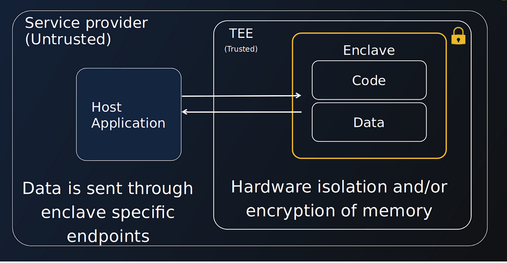

# How does BlindBox protect your data?
_________________________________

BlindBox is able to protect user data and models by leveraging the power of confidential computing, a fast-growing new technology in cybersecurity. Let’s take a look at what Confidential Computing is and how it protects your data.

The [Confidential Computing Consortium](https://confidentialcomputing.io/) (CCC) describes confidential computing as “the protection of data in use by performing computations in a hardware-based Trusted Execution Environment (TEE)”.

## What is a Trusted Execution Environment?
____________________________________

A **TEE**, otherwise known as a secure enclave, is a **highly isolated compute environment** where data and applications can reside and run. Data sent to the enclave is only decrypted inside the enclave. Even if hackers or malicious insiders gain access to the host machine an enclave is running on, they will not be able to access data inside the enclave.

## Trusted Computing Base
______________________________________

One strategy to reduce the enclave's attack surface pursued by many CC solutions is reducing the Trusted Computing Base (TCB).

### So what is the TCB?

Normally, when you run an application on a computer, you need to trust multiple elements: the application itself, the operating system, the hypervisor and the hardware. This doesn't mean we "trust" them in the everyday sense of the word- this means that our application could be affected by a bug or vulnerability in these elements! These trusted elements makes up what we call the **Trusted Computing Base** or **TCB** of our application.

A key difference between our two currently supported TEE environments, SGX enclaves and Nitro enclaves, is that Intel SGX has a very minimal TCB while Nitro enclaves have not pursued this strategy to reduce their attack surface area. Check out our more detailed [Intel SGX vs Nitro Enclaves page](../concepts/Trusted_Execution_Environements.md) for more details.

## Attestation
___________________

When a user wants to establish communication with an enclave, checks will first be performed to **verify the authenticity** of these trusted elements.

These checks will **verify the enclave identity and the application** running inside the enclave. 

!!! important

	The goal of this process is to check that the code running is indeed the code of the application we are expecting and has not been tampered with. It isn't to audit the application code itself. You can think of this a bit like a checksum when you download a software!

With Intel SGX, this process also verifies that the **enclave is running on genuine Intel SGX hardware**, whereas for Nitro enclaves, the **trusted OS is verified**.

If any of these **checks fail**, an error is produced and the **user will not be able to communicate with an enclave**. For BlindBox, this means that if a user tries to connect to a BlindBox server that has been tampered with or is not running the official latest version of the BlindBox server, they will fail. If these checks are **successful**, the user is able to **communicate** with the enclave **securely using TLS**. The enclave's private key never leaves the enclave, so it is never accessible to anyone, not even the cloud or service provider.

## Limitations
__________________________

With great security features come great responsibilities! TEEs also have limitations which are very important to know:

+ The **official BlindBox application code must be trusted**! The attestation process verifies that the enclave is running the official server application, but it does not run any checks on what the verified application code does. This is why BlindBox is open-source, so you can audit our code yourself. You can also refer to [the report from Quarkslab]() (*coming soon*), the independent company who audited our BlindBox Core solution.

> Note that this audit was performed on the latest version of BlindBox at the time and does not cover **the client-side SDK**, **BlindBox API** or **Nitro enclaves**.

+ **Zero-day attacks** are **always a risk**, even with enclaves. They happen when hackers exploit previously unknown flaws *before* developers have an opportunity to fix the issue. We mitigate that risk by keeping BlindBox up-to-date with the security updates of our dependencies.

### Nitro Enclaves specific

+ **AWS, as the cloud provider, their hardware and the enclave’s OS** must be **trusted**. That is because Nitro enclaves are designed to separate and isolate the host from the enclave and vice versa, but they do not protect against the cloud operator (AWS) or infrastructure. (*See our [Nitro guide](https://blindbox.mithrilsecurity.io/en/latest/docs/concepts/Trusted_Execution_Environements/#nitro-enclaves) for more information.*)

+ While **Nitro enclaves** limit operations within enclaves by default (such as no durable storage, no network/interactive access), any of these features can be added back into an enclave application by the application provider, so we cannot assume a Nitro enclave will not have these features. In the case of BlindBox, we do not have durable storage or interactive access but we do add a Traffic Access Point (TAP) device which is used to facilitate network access for applications. And this, again, means we must trust the verified BlindBox application code!

## Conclusions
___________________________________________

That brings us to the end of this introduction to confidential computing. Let’s sum up what we’ve covered:

- Trusted Execution Environments are **highly isolated compute environments**.
- Confidential computing technologies often pursue a minimal Trusted Computing Base (TCB) to **reduce the attack surface**.
- During the attestation process, we **verify that the application code** in the enclave has not been modified or tampered with.
- We also **verify the authenticity of the enclave and OS**.
- If attestation is successful, **communication** between the client and enclave is **established using TLS**.
- TEEs, like any other technology, don't solve every problems. They **have limitations** and it is important to keep them in mind.

If you haven’t already, you can check out our [Quick Tour](quick-tour.ipynb) to see a hands-on example of how BlindBox can be used to protect user data while querying AI models.