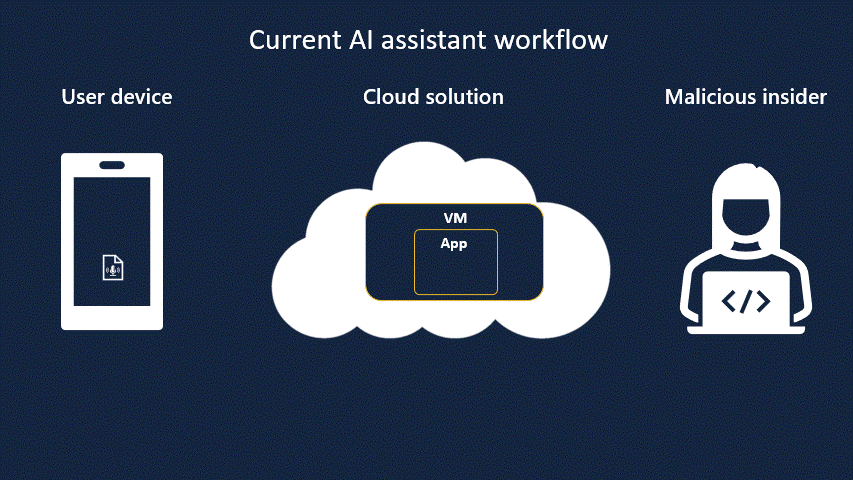

# Overview

## What is Blindai?

BlindAI is a confidential AI inference server. Like regular AI inference solutions, BlindAI helps AI engineers serve models for end-users to benefit from their predictions, but with an added privacy layer. Data sent by users to the AI model is kept confidential at all times, from the transfer to the analysis. This way, users can benefit from AI models without ever having to expose their data in the clear to anyone: neither the AI service provider nor the Cloud provider (if any), can see the data.

Confidentiality is assured by using special hardware-enforced Trusted Execution Environments. More explanations about them in [this section](privacy.md).

Our solution comes in two parts:

- A secure inference server to serve AI models with privacy guarantees, developed using the Rust Programming Language.
- A Python client SDK to securely consume the remote AI models.

BlindAI workflow is simple:

- [Launch](../getting-started/installation.md): Our server is deployed on a machine with secure enclave capabilities.
- [Remote attestation](privacy.md): The remote client asks the server to provide proof that it is indeed serving a secure enclave with the right security features.
- [Prediction](../../index.md): Once remote attestation passes, the client can send data to be safely analyzed using a TLS channel that ends inside the enclave. The AI model can be uploaded and applied, then the result is sent securely.

## Features

* Simple and fast API to use the service
* Model and data protected by hardware security
* Support of Remote Attestation with TLS (DCAP library)
* Easy to install, deploy, and maintain

### What you can do with BlindAI

* Easily deploy state-of-the-art models with confidentiality. Run models from **BERT** for text to **ResNets** for **images**, through **WaveNet** for audio.
* Provide guarantees to third parties, for instance, clients or regulators, that you are indeed providing **data protection**, through **code attestation**.
* Explore different scenarios from confidential _Speech-to-text_ to _biometric identification_, through secure document analysis with our pool of **examples**.

### What you cannot do with BlindAI

* Our solution aims to be modular but we have yet to incorporate tools for generic pre/post-processing. Specific pipelines can be covered but will require additional handwork for now.
* BlindAI does not cover training or federated learning, however you can check our [roadmap](https://github.com/mithril-security/blindai/projects/1) or [Discord](https://discord.gg/TxEHagpWd4) channel to know more about what we are working on and solutions.
* The examples we provide are simple and do not take into account complex mechanisms such as secure storage of confidential data with sealing keys, an advanced scheduler for inference requests, or complex key management scenarios. If your use case involves more than what we show, do not hesitate to **contact us** for more information.

## Who made BlindAI?&#x20;

BlindAI was developed by **Mithril Security**. **Mithril Security** is a startup focused on confidential machine learning based on **Intel SGX** technology. We provide an **open-source AI inference solution**, **allowing easy and fast deployment of neural networks, with strong security properties** provided by confidential computing by performing the computation in a hardware-based **Trusted Execution Environment** (_TEE_) or simply **enclaves**.
