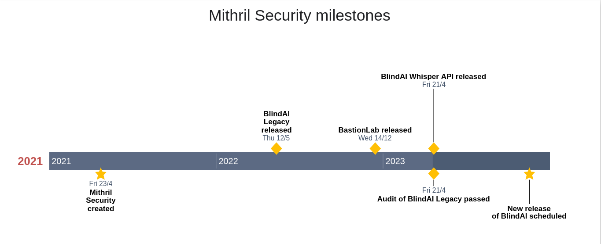

# 👋 Welcome to BlindAI!
________________________________________________________

A data privacy solution for Large Language Model SaaS deployment, ensuring user data remains confidential at all times!

## What is BlindAI?
________________________________________________________

**BlindAI** is a **privacy solution** allowing developers to deploy their **Large Language Models** (LLM) SaaS solutions while **ensuring** user **data remains confidential** at all times.

Data sent by users to these models are kept **confidential at all times** by hardware-enforced **Trusted Execution Environments**. We explain how they keep data and models safe in detail [here](docs/getting-started/confidential_computing.md).

**BlindAi** consists of:

- **BlindAI API**: A Python library 🐍 for querying popular LLM models hosted by Mithril Security.

- **BlindAI CLI (coming soon)**: An easy-to-use CLI tool for application deployment in highly isolated environments called secure enclaves.

> You can check out [the code on our GitHub](https://github.com/mithril-security/blindai/). 

We’ll update the documentation as new features come in, so dive in!

## Getting started
________________________________________________________

- Follow our [“Quick tour”](./docs/getting-started/quick-tour.ipynb) tutorial
- [Tackle](./docs/getting-started/confidential_computing.md) the technologies we use to ensure privacy
- Check out how our BlindAI API works [under the hood!](./docs/getting-started/under-the-hood.ipynb)

## Getting help
________________________________________________________

- Go to our [Discord](https://discord.com/invite/TxEHagpWd4) *#support* channel
- Report bugs by [opening an issue on our BlindAI Github](https://github.com/mithril-security/blindai/issues)
- [Book a meeting](https://calendly.com/contact-mithril-security/15mins?month=2022-11) with us

## Who made BlindAI?

BlindAI was developed by **Mithril Security**. **Mithril Security** is a startup focused on confidential machine learning based on **Confidential Computing** technology. We provide **open-source privacy solutions** to **query** and **deploy AI models** while **guaranteeing data privacy**.

So far, we have developed the following solutions:
- BlindAI Legacy: Allowing AI engineers to deploy AI models in secure confidential environments
- BlindAI API: Allowing developers to query Large Language Models (LLMs) in secure confidential environments
- BlindAI new release (**coming soon**): Allowing developers to deploy their applications in secure confidential environments

