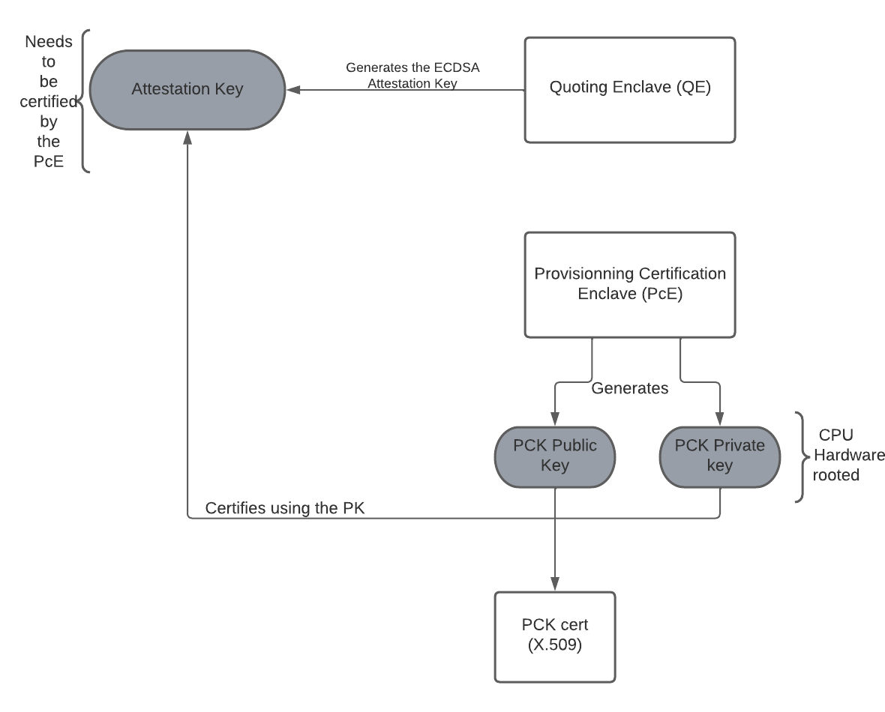

# Remote attestation Implementation
This document details the remote attestation as implemented on *BlindAI* for **Intel SGX** platforms. 

The remote attestation is the process by which a remote application verifies that the code running is truly within a secure enclave. 

The different points that will be described are presented on the summary below : 
## Summary
1. [Theory](#Theory)
2. [Remote attestation with fortanix](#fortanix)
3. [Remote attestation client side](#client)
4. [references](#references)

## Theory 
There is two concepts for achieving remote attestation on Intel SGX. The first one, is **EPID attestation** which relies on Intel services to attest that an enclave on specific platforms is trustworthy. 
The second one is **DCAP (DataCenterAttestationPrimitives)** and it allows data centers to own their own attestation. 
Our implementation relies on the latter, where we have to possibility to build our own attestation infrastructure using public keys algorithm, in our case ECDSA. 

WARN(clauverj) : Actually we only support ECDSA but we don't build our own attestation infrastructure...

### Overall architecture 
As explained in [1] & [2], ECDSA attestation sequence relies on three different platforms to achieve the verifications needed : 
- The Intel SGX platform, 
- The Data Center Caching Service
- The target service, in our case the client. 

The Intel SGX platform provides us with the necessary measurements and functions (see section below) used to generate the signatures related to the code and enclave running on it.

### Instruction needed & structures
The instruction set for intel SGX defines 18 different instructions. The set that is involved in the remote attestation are: `EGETKEY` and `EREPORT`. 
The structures that will be used on the remote attestation are `TARGETINFO` & `REPORT`. 

### Measurement 

WARN(clauverjat): You don't define ISV :  (independent software vendor)
WARN(clauverjat) :  To be precise The measurement doesn't contain a hash of the user data,
it contains 64bytes of user data (which in our case are used to store a hash, but 
you could put a public key directly if it is short enough for instance) 

The measurement represents the enclave's signature. In the design of the quote (signature) it includes the following data [4] :
- Measurement of the code and data in the enclave. 
- A hash of the public key in the ISV certificate presented at enclave initialization time. 
- The Product ID and the Security Version Number (SVN) of the enclave. 
- Attributes of the enclave (defining if it is in debug moded for instance).
- hash of the user data included in the reportdata of the `REPORT`. 

Quote's information : `MRENCLAVE`, `REPORT`, `MRSIGNER`

### Under the hood - How it works
Each enclave running on an SGX platform can generate its own report, based 
An ECDSA attestation key is generated by the QE (Quoting Enclave). The key is a 256-bit ECC signing key, and it's generated as follows :  

- The PCE provides an interface to retrieve the PCK certificate Identifier 
- The PCE provides a mechanism to sign another enclave (for example QE) REPORT using the PCK cert private key. 
- In DCAP attestation, the QE generates the ECDSA Attestation Key and include its hash in the REPORT structure (`QE.REPORT.ReportData`). 

This attestation key (AK) is then used to sign application enclave reports and the result is called the ECDSA quote. this generation is done on the quote generation part. There is two ways to communicate with the architectural enclaves. **The in-process mode**, where the quote generation libraries are loaded into the application's process. The **out-process mode** (___used in this implementation___), uses the AESM service to contact the different AE. 

The quote verification part, is the generation of the quote verification collateral. 

### Quote generation 
After initiating the AESM client, the ECDSA Attestation Key is retrieved by contacting the AESM service. We then use this ECDSA Key to generate the `TARGETINFO` structure. This structure is generated from the QE (Quoting Enclave) using the returned ECDSA key and always through the AESM service. 

The targetinfo is then sent to the enclave to use it to generate the `REPORT`. In fact, using the `EREPORT` instruction, and with the `TARGETINFO` passed on, we generate the `REPORT` structure that will be then used to generate the quote. 

To be able to sign the `REPORT` to obtain to quote, the quoting enclave must be used again. The return is a success if the `REPORT` is valid and generated with the right `TARGETINFO`. 

### Quote verification (Collateral)
Collateral. 

### Attestation verification 

## Remote attestation in fortanix (Server-side) 
Ouur implementation in *fortanix EDP* relies on AESM (Application Enclave Service Manager) to manage the architectural enclaves (LE, PvE, PcE, QE, PSE). The AESM service makes it possible to communicate with the architectural enclaves from the application enclave [3].  

_**to review**_ : Currently AESM is binded to the host's. We have to see how we can use it with future kubernetes deployements. Questions : What happens it multiple AESM services are run in the same time? is it possible to have multiple architectural enclaves in the same time ? 

### Quote generation

### Quote collateral 

## Remote attestation verification in the client 

## References
- [1] John P Mechalas, *"Intel DCAP overview"*, 2021 : [*Quote Generation, Verification, and Attestation with Intel® Software Guard Extensions Data Center Attestation Primitives (Intel® SGX DCAP)*](https://www.intel.com/content/www/us/en/developer/articles/technical/quote-verification-attestation-with-intel-sgx-dcap.html)

- [2] Vinnie Scarlata, Simon Johnson, James Beaney, Piotr Zmijewski
Intel Corporation 2018 *"Supporting Third Party Attestation for Intel® SGX
with Intel® Data Center Attestation Primitives"* : *https://www.intel.com/content/dam/develop/external/us/en/documents/intel-sgx-support-for-third-party-attestation-801017.pdf*

- [3] SSLab, Georgia Institute of Technology, 2017 *"Communication between Architectural and Application Enclaves"* : *https://sgx101.gitbook.io/sgx101/sgx-bootstrap/enclave/interaction-between-pse-and-application-enclaves*

- [4] Intel, *Intel® Software Guard Extensions Developer Guide* : *https://download.01.org/intel-sgx/linux-1.7/docs/Intel_SGX_Developer_Guide.pdf*